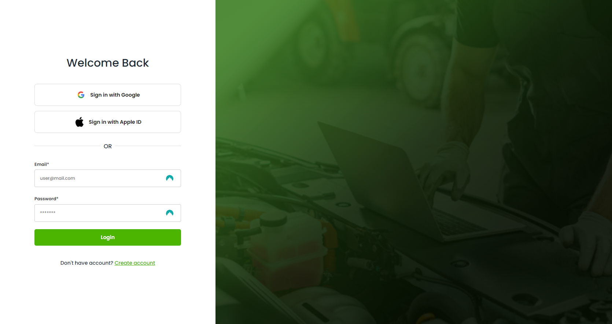
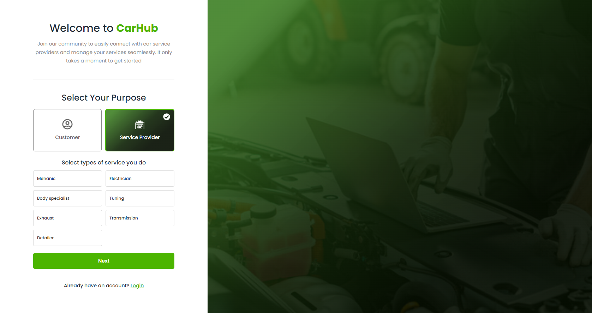
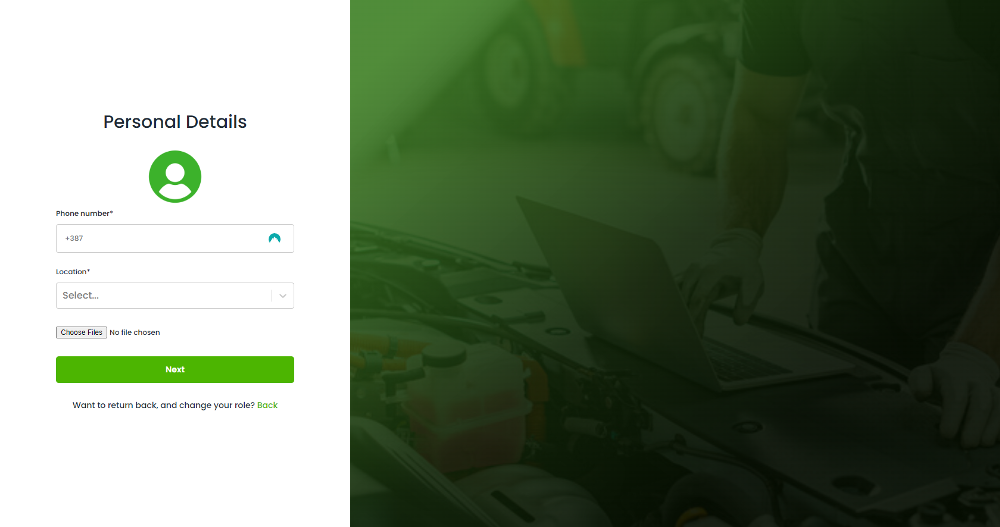
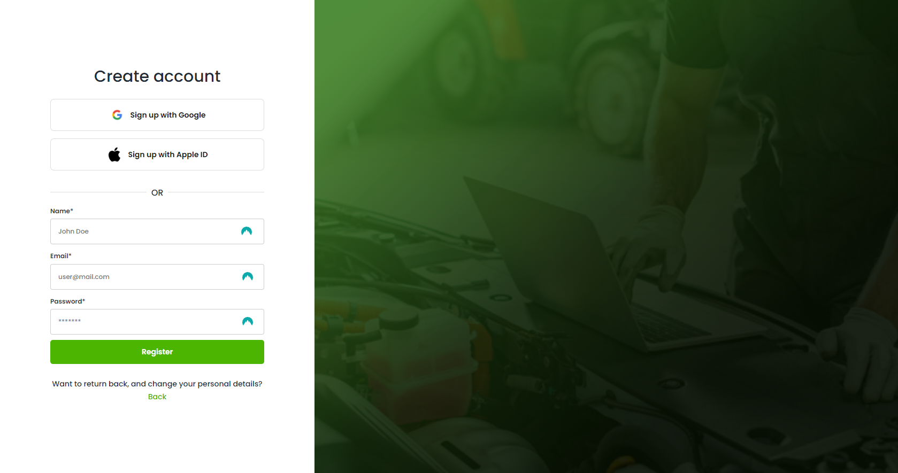
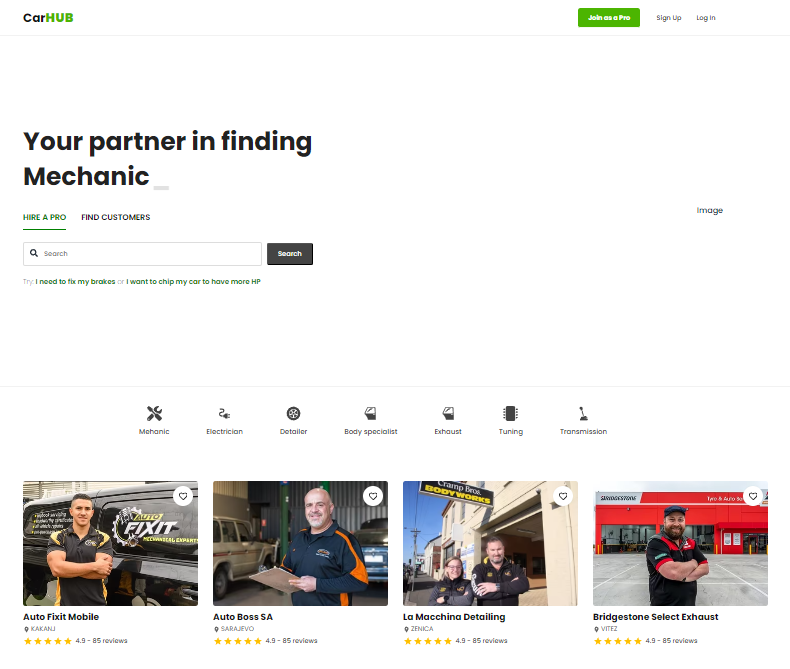

# Auto Industry Web App ( CarHub )

Welcome to the CarHub repository! This guide will help you get started with setting up the project and running it on your local machine.

## Getting Started

### Prerequisites

Make sure you have **Git**, **Node.js**, and **npm** installed on your system.

1. **Clone the repository**:

   ```bash
   https://github.com/aditokmoo/auto-industry-web-app.git

2. **Navigate to the project folder**:
   
   ```bash
   cd repo-name

3. **Navigate to the client folder and install the dependencies**:

   ```bash
   cd client
   npm install

4. **Do the same for the backend folder**:

   ```bash
   cd backend
   npm install

5. **Running the project**:
- Start the client:
   ```bash
   cd client
   npm run dev

- Start the backend:
   ```bash
   cd backend
   npm run dev

The client and backend should now be running locally.

## Screenshots
Here are some images to showcase the project

1. Login


2. Register





3. Home (In progress...)


## Technologies Used

- **Frontend**: React, Typescript, Axios, React Form Hook, Tanstack React Query, Tanstack React Table, SCSS.
- **Backend**: Node.js, Express, MongoDB, Typescript.

